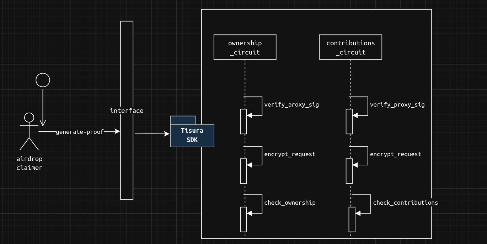
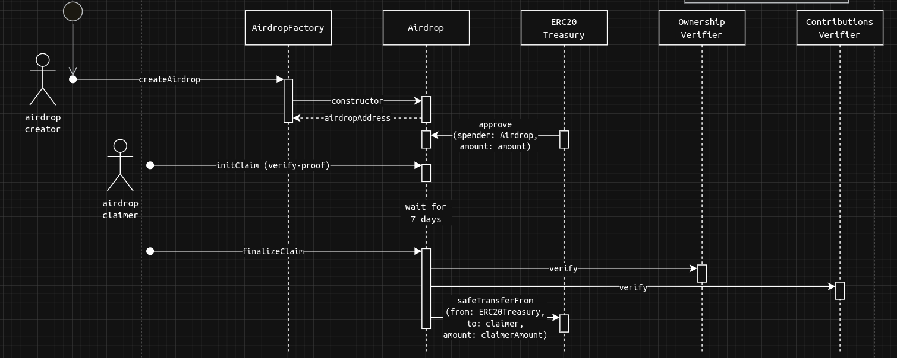

# Trustless Airdrop Launchpad

## Problem

Airdrops are valuable for protocols to design incentives, but the current designs have their challenges.

A technical challenge is to index every user, and make sure they're eligible to the airdrop. On the user side, there's the trust assumption that this will be done correctly by the airdrop creator, for example, no one really knows if the airdrop creator indexed some insiders that are not eligible.

## Solution

Now as an airdrop creator, imagine a magical launchpad where you can launch your next airdrop campaign with few clicks, creating a smart contract based on your airdrop parameters.

As an airdrop claimer, imagine a magical proof, that you provide to the airdrop contract, and it drops you tokens if and only if you're eligible!

This not only solves the technical challenge for airdrop creators, but also shifts the trust requirement just to the airdrop contract. We built a proof of concept on top of *Tisura SDK*, a **Trustless Airdrop Launchpad** for Github Contributions, it verifies the number of contributions to a Github repository and drops tokens to the airdrop claimer accordingly.

## Workflows

An airdrop creator can create an airdrop via our interface, which calls our `AirdropFactory` contract. The factory deploys a new `Airdrop` contract for each campaign with its airdrop parameters, including: the token, the treasury, rewards per contributions, and the proofs verifiers.

An airdrop claimer can claim an airdrop via another dedicated interface, where they submit their information, create a proof of eligibilty via Tisura SDK (which uses [Noir](https://noir-lang.org/) circuits behind),

### Circuits design

1. Verify that the encrypted API response genuinely comes from GitHub. Currently, we use a centralized proxy, which introduces a trust assumption, but we plan to decentralize it.
2. Decrypt the response.
3. Validate that the response matches the expected values.

Note this is all happening inside the user device, thanks to client-side proving enabled by [Noir](https://noir-lang.org/). Tisura has no access to User's decrypted traffic.

### Contracts design

- Deploy new `Airdrop` contracts for each campaign.
- To mitigate [front-running](https://en.wikipedia.org/wiki/Front_running), we introduce a Commit-Reveal scheme for claiming the airdrop.
